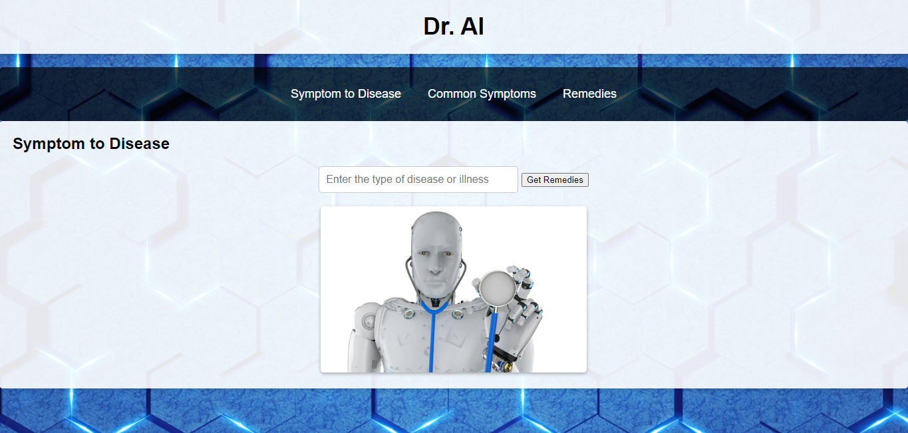

# Dr. AI -

## Project Overview
This project aims to create a webpage called Dr. AI that displays a list of common symptoms. Users can select their symptoms, and they will be shown a list of remedies, including over-the-counter drugs and other relevant solutions. The webpage will consist of three tabs: Symptom to Disease, Common Symptoms, and Remedies. Users can navigate between these tabs to find information related to their symptoms and potential remedies.

## Group Members
- Sujatha
- Briana Lui
- Andy Metz
- Anitha Pandian
- Younes Smyej

## Data Sources
To build the Dr. AI webpage, we will be using the following data source:

- [FDA Drugs API](https://api.fda.gov/drug/drugsfda.json): We will utilize the FDA Drugs API to access information about various drugs, including their indications, side effects, and recommended usage. This data will help us provide accurate and up-to-date information on remedies for specific medical conditions.

## Technical Implementation
We will develop the Dr. AI webpage using Node.js for server-side programming. We will also use Leaflet, a JavaScript library, for data visualization and creating interactive maps. Additionally, we will integrate the FDA Drugs API to retrieve information about drugs and their associated conditions.

## Project Flow
1. Symptom to Disease Tab: Users will be able to select their symptoms from a predefined list. The webpage will then query the FDA Drugs API to identify potential diseases associated with those symptoms.

2. Common Symptoms Tab: This tab will display a list of common symptoms, allowing users to explore and understand symptoms related to various medical conditions.

3. Remedies Tab: Once users have selected their symptoms, this tab will utilize the FDA Drugs API to provide them with a list of remedies, including over-the-counter drugs and other relevant solutions for the identified diseases.

## Presentation
During the presentation, each group member will have the opportunity to speak and contribute to the discussion. We will cover the project objectives, the data source used, the technical implementation details, and showcase the features of the Dr. AI webpage.

By following these guidelines and working collaboratively, we aim to create an interactive and informative webpage that helps users find remedies based on their symptoms. We are committed to meeting the project requirements and delivering a high-quality result.

