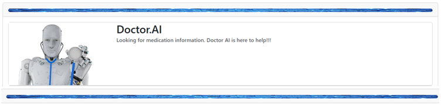

# Dr. AI -

#### Reference_Doc folder contains screenshots of this Doctor.AI webpage and READMEfile on how to set up and run this project
--
## Project Overview
This project aims to create a webpage called Doctor.AI(in short Dr.AI) that displays a list of medication. Dr.AI provides a user-friendly webpage with options to choose between Over the counter or Prescription or Discontinued medication type and view results with seamless experience for users.

## Group Members
- Sujatha
- Briana Liu
- Andy Metz
- Anitha Pandian
- Younes Smyej

## Data Sources
To build the Dr. AI webpage, we will be using the following data source:

- [FDA Drugs API](https://api.fda.gov/drug/drugsfda.json): We will utilize the FDA Drugs API to access information about medications marketing status and label information. This data will help us provide accurate and up-to-date information about each medication.

## Technical Implementation
* Mongo DB
* Python Flask API
* Vue.js, Plotly.js
* BootsrapVue
* HTML

## UI Elements 
* Option Button to choose medication type
* Table that display Medication name, dosage form, Intake route and active Ingredients/strength
* Filter and sort the displayed records
* Pie-Chart view that displays medication count by dosage form
* Bar-Chart view that displays medication count by Intake route

## Additional UI Features
* Data from source (FDA site) will be refreshed at page load(Drugs@FDA API call using Marketing staus).
* Optionally, a button "Refresh data again? Click Me" is also provided to refresh data from source(Drugs@FDA API call using Marketing staus).
* Dashboard will display with more detailed infomration directly from FDA website using Drug Labeling API call using Medication brand name when the user clicks on specifc medications "More Details" button.

**-- Content in Main Branch: --**
1. Reference_Doc folder contains details on how to execute this project and screenshots
2. server folder contains app.py(FLASK API call code) and requirement.txt contains all libraries required for this project
3. client folder contains vue, js and HTML files which will be used on clinet(user) end along with package.json files that contains all required installables needed on clinet side
4. DR. AI_Slide_deck - detailed presentation of this project. 

